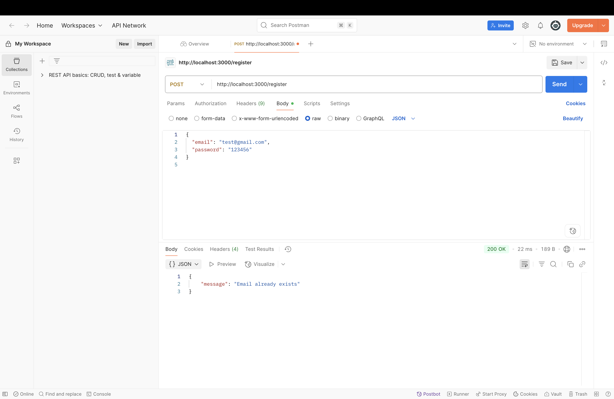
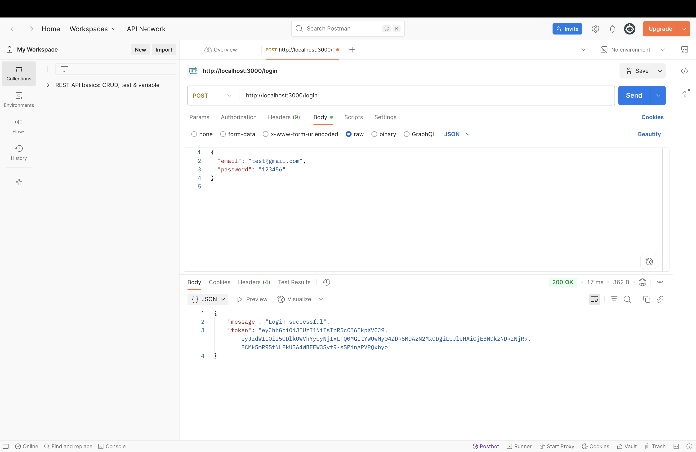

# Reflection: Building an Authenticated Backend with Hono, TypeScript, Prisma & JWT

## Core Concepts Implemented

In this exercise, I developed a secure RESTful API using **Hono**, **TypeScript**, **Prisma**, and **PostgreSQL**. The focus was on **authentication** and **authorization**, and I applied several key techniques:

* Built endpoints for user registration and login
* Secured API routes using **JWT tokens**
* Hashed user passwords using **Bun's hashing utilities**
* Integrated **middleware** to validate tokens on protected endpoints
* Used **Prisma ORM** to manage user-account relationships
* Handled exceptions for authentication-related failures
* Followed REST conventions with appropriate status codes and responses

---

## Key Learnings

This practical helped me understand the full process of implementing secure authentication mechanisms in modern backends. I learned how to:

* Set up user login and signup features with proper input validation
* Encrypt passwords before storage using `Bun.password.hash`
* Create and verify JWT tokens for stateless, secure authentication
* Use Prisma to structure and query relational data
* Leverage middleware to restrict access to protected endpoints
* Respond to authorization errors gracefully using HTTP error codes
* Organize backend logic cleanly by separating concerns

I also solidified the distinction between **authentication** (confirming identity) and **authorization** (managing access control), and how both contribute to building secure web APIs.

---

## Challenges & Solutions

### Challenge 1: Prisma Error Handling

* **Problem:** Users attempting to sign up with an already-used email caused the app to crash due to unhandled Prisma exceptions.
* **Solution:** I resolved this by catching `PrismaClientKnownRequestError`, checking for unique constraint violations, and sending a clear, user-friendly error message.

---

### Challenge 2: JWT Token Setup

* **Problem:** Initially, I struggled with setting up JWT signing and validation, especially while applying middleware to protect routes.
* **Solution:** I reviewed Hono’s documentation and correctly implemented both the `sign` utility for token generation and the `jwt()` middleware to protect routes and verify user identity.

---

## Final Thoughts

Completing this task gave me a solid foundation in backend security. The most valuable takeaways include:

* Gaining hands-on experience with secure login and session handling
* Understanding how JWT enables stateless authentication in REST APIs
* Learning to structure and query a relational database using Prisma
* Improving my ability to handle backend errors and protect sensitive endpoints
* Recognizing the importance of hashing credentials and securing tokens

This project has strengthened my backend development abilities and given me confidence in implementing authentication and authorization for real-world applications. It also highlighted the security best practices that are essential when working with user data and protected routes.

