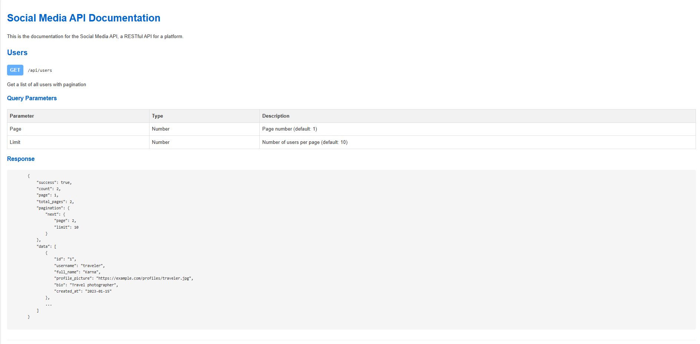
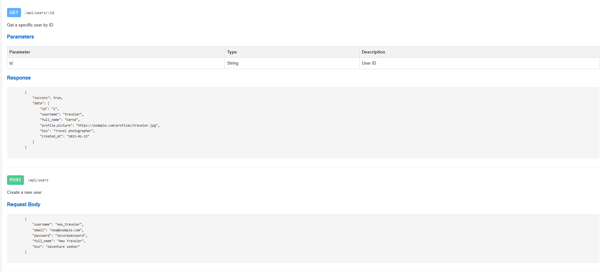
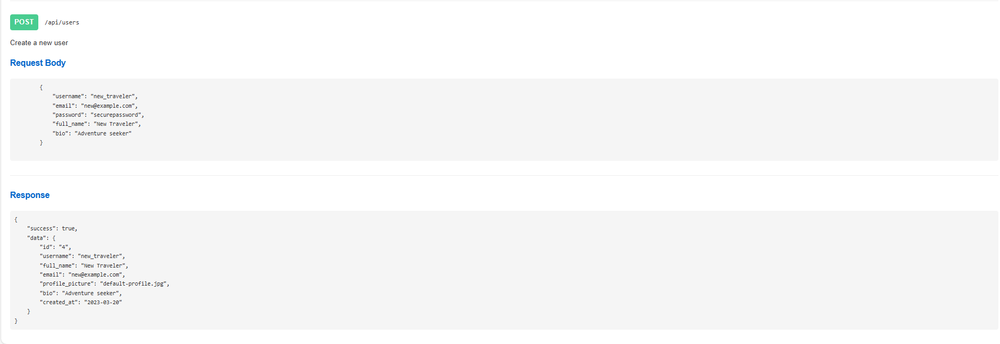

# Social Media API

In this project, I implemented a RESTful API for a social media platform. The main concepts applied include:

- **REST Principles**: I used standard HTTP methods (GET, POST, PUT, DELETE) to design CRUD operations for different resources such as users, posts, comments, likes, and followers.
- **Authorization**: Each endpoint requires a Bearer token for authentication, simulating secure access control.
- **JSON-based Communication**: Both request and response bodies follow the JSON format to ensure consistency and compatibility.
- **Resource-oriented URIs**: I followed semantic naming for endpoint paths, e.g., `/users`, `/posts/{id}`, keeping it intuitive and clean.
- **Pagination**: The GET /users endpoint supports pagination through query parameters (`page`, `limit`).
- **Modular Design**: The API is divided by resource types (Users, Posts, Comments, Likes, Followers), ensuring separation of concerns.

## Reflection

### What I Learned

- I gained a solid understanding of how RESTful APIs are structured and documented.
- I learned to work with authorization headers and how token-based auth is integrated into each request.
- I improved my skills in writing clear, concise, and complete API documentation in markdown.
- I practiced designing endpoints that are scalable and easy to use for frontend consumption.

### Challenges Faced

- **Formatting Complex Tables in Markdown**: It was tricky to align and format large tables for different HTTP methods and endpoints. I overcame this by using markdown table preview tools and manually verifying alignment.
- **Ensuring Consistent Response Structures**: Initially, some endpoints had inconsistent keys (e.g., `message` vs `data`). I resolved this by designing a uniform JSON structure (`success`, `data`, `message`) across all endpoints.
- **Deciding URI Structures**: Choosing between `/likes/{postId}` vs `/posts/{postId}/likes` was a challenge. I chose flat resource paths for simplicity but kept future nesting in mind.

### Screenshots

---

Overall, this project deepened my understanding of backend API design. I now feel more confident in designing structured, scalable, and well-documented APIs for full-stack applications.
