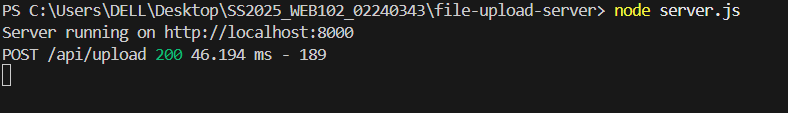
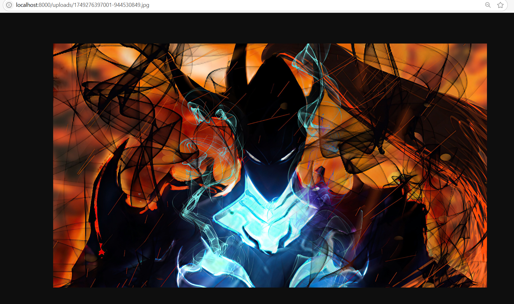

# File Upload Server

In this practical, I implemented a server-side file upload system using Node.js and Express. The key concepts applied include:

- **Multipart Form Data Handling**: Using the Multer middleware to parse and process multipart/form-data requests, allowing file uploads to be received and saved on the server.
- **File Validation and Security**: Validating uploaded files for type and size to prevent unauthorized or harmful files from being stored.
- **Error Handling**: Implementing both backend and frontend error handling to provide clear feedback for upload failures such as invalid file type or oversized files.
- **CORS Configuration**: Setting up Cross-Origin Resource Sharing (CORS) middleware to enable communication between the frontend (React/Next.js) and backend (Express), which run on different ports.
- **Upload Progress Tracking**: Utilizing Axios’s `onUploadProgress` callback on the frontend to show real-time upload progress to users.

---

## Reflection

### What I Learned

This practical gave me a thorough understanding of the complete file upload process, from the client side form submission to backend processing and storage. I learned how multipart form data is structured and how Multer simplifies handling this on the server.

I also learned the importance of validating file inputs to secure the application and how to configure CORS properly to enable cross-origin communication without compromising security.

In addition, implementing progress tracking improved my knowledge of enhancing user experience during file uploads.

### Challenges Faced and How I Overcame Them

- **CORS Issues**: Initially, the frontend requests were blocked due to missing or misconfigured CORS headers. I resolved this by explicitly allowing the frontend origin in the backend’s CORS middleware configuration.

- **File Validation**: Ensuring that only allowed file types and sizes were accepted required careful setup in Multer’s `fileFilter` and `limits` options. Testing with different file inputs helped identify edge cases and improve validation logic.

- **Error Handling**: Handling errors from Multer and sending meaningful responses to the frontend was tricky. I added custom error-handling middleware in Express and updated the frontend to catch and display these errors gracefully.

- **PDF Preview Handling**: Unlike images, PDFs cannot be previewed visually in the same way. I updated the frontend to show PDF filenames and relevant info instead, improving usability.

## Results

___

Overall, this practical enhanced my skills in backend middleware configuration, security considerations for file uploads, and frontend-backend integration for a smooth user experience.
